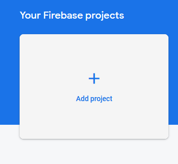
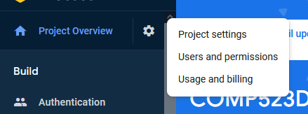
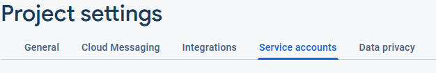
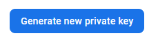
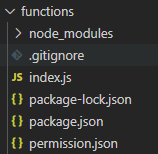
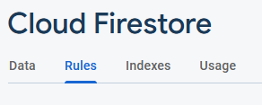
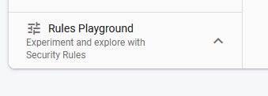

# Guide to Using Team R Demo #
## Set up Firebase Project ##
(This is only if you want to create a new environment. You do not have to follow this part if you want to use our demo files.)
1. Create Firebase Project <br>
    Click on Add project in Firebase Console and follow the instructions <br>
    
2. Local Set Up 
    To use Firebase Firestore and Cloud Functions,
    Run the following lines in your terminal.
    ```commandline
    npm install -g firebase-tools
    firebase login
    firebase init firestore
    firebase init functions
    ```
## Set up Service Account ##
1. Go to Project Settings in your Project Overview <br>

2. Then go to Service Account <br>

3. Click and generate new private key <br>

4. Save the new private key into functions folder as permission.json <br>


## Play around with Demo ##
Un-comment out the part the function that you want to test with
- Local Testing
    Run the following code with your terminal
    ```commandline
    firebase emulators:start
    ```
    You should be able to see a url generated in the terminal. Combine that url and the part of url that you set and test it in Postman.
- Cloud Function
    Run the following code with your terminal
    ```commandline
    firebase deploy --only functions
    ```
    When the deploy is finished, you should be able to see a url generate in Firebase Functions. 
- Testing rules with Firebase
    You can also play with rules to achieve data type verification and access controls. 
    Click on Firebase Database in Firebase Console and go to Rules.<br>
     <br>
    You can modify and use rules playground to test the rules. <br>
    